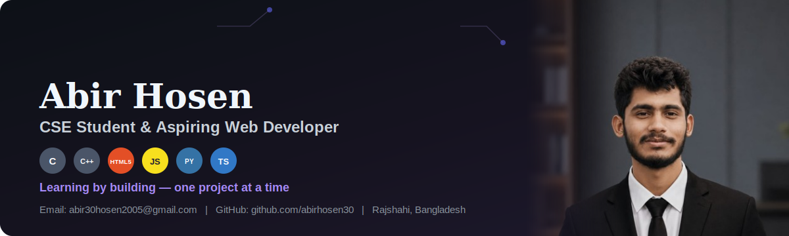

<!-- Banner -->

  
  <!-- Name & Designation (animated typing) -->
  

### 👋 About Me
I'm a Computer Science undergraduate student from Bangladesh, currently building a strong foundation in **Software Development**, with a growing interest in **AI/ML Engineering**.I enjoy exploring different aspects of technology, turning theory into small.

### 🔭 Currently
- 💻 Learning **Full Stack Web Development**, planning to build some large-scale projects
- 🧠 Growing my interest in **AI/ML**, aiming to work on real-world ML pipelines and Computer Vision projects
- 🌱 Always exploring new tools and technologies

### 🧰 Skills
**Languages**

  

**Markup & Styling**

  

**Frontend**

  

**Tools & Others**

  

### 🌐 Connect with Me

  
  

### 📊 GitHub Stats

